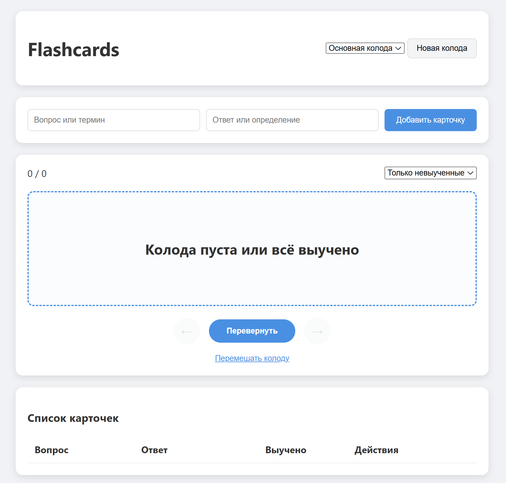

# 🃏 Flashcard Learning App

A modular, OOP-driven Vanilla JavaScript web application for creating, managing, and studying flashcard decks with automatic persistence and custom study modes.



---

---

## 📋 Features

- 📚 **Deck & Collection Management**: Create custom decks/collections to categorize study subjects.
- 🎴 **Interactive Card Viewer**: Flip cards between questions and answers, shuffle decks, and track progress with active card counters.
- 🎯 **Targeted Study Modes**:
  - **All Cards**: Review the complete collection.
  - **Unlearned Only**: Focus exclusively on cards that haven't been mastered yet.
- 💾 **Automatic Storage Persistence**: Encapsulated `LocalStorage` synchronization running seamlessly in the background (auto-saves every 5 seconds).
- ✏️ **Full CRUD Operations**: Easily add, edit, delete, and mark cards as learned using an interactive data table.
- 🧱 **Clean Architecture**: Decoupled Separation of Concerns using ES6 class modules (`Storage`, `Manager`, and `UI`).

---

## 🛠️ Tech Stack

- **HTML5**: Semantic tags and modular script integration (`type="module"`).
- **CSS3**: Modern variables, responsive Flexbox layout, and clean card UI transitions.
- **JavaScript (ES6+)**:
  - ES6 Modules for decoupled architecture.
  - Object-Oriented Programming (Classes & Encapsulation).
  - Native `LocalStorage` for client-side persistence.
  - Dynamic Event Delegation for table and card management.

---

## 📁 Architecture Overview

The application follows clean Object-Oriented design principles split into distinct modules:

```text
├── index.html           # Main markup structure
├── style.css            # Custom layout and CSS variables
├── main.js              # Application entry point & dependency wiring
├── Storage.js           # Encapsulated LocalStorage interface
├── FlashcardManager.js  # Business logic & deck state management
└── FlashcardUI.js       # DOM rendering and UI event handling
```
